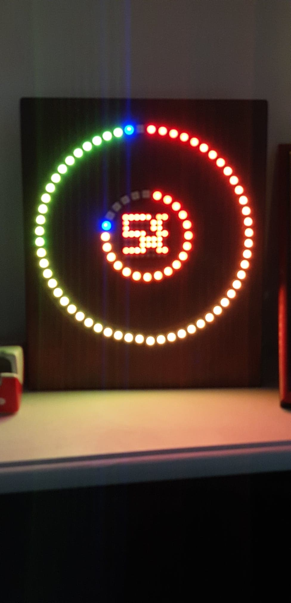
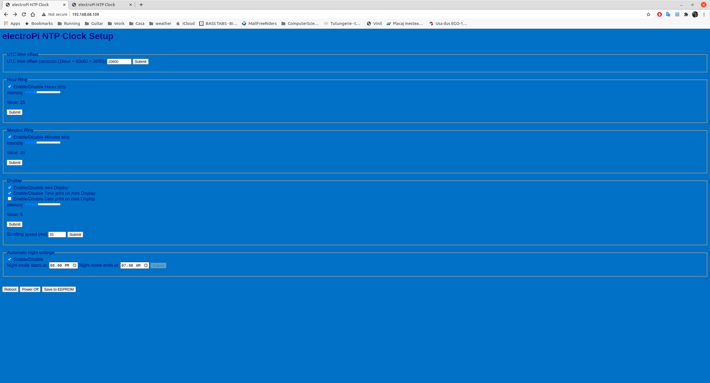
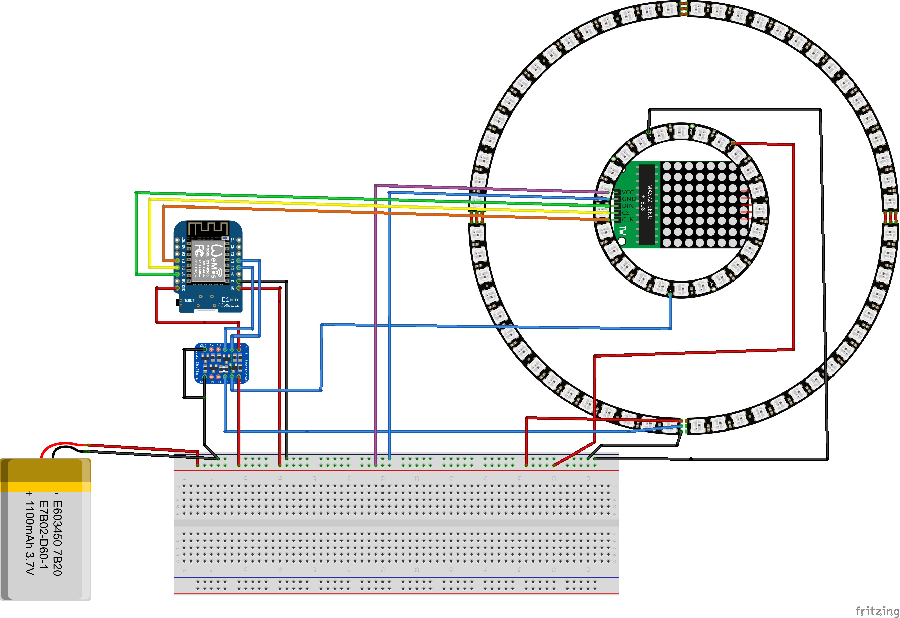

# 24 Hour display NTP Neopixel clock

This clock is built using the following hardware components:

* one 60 bit neopixel (ws2812b) neopixel ring, used to display the minutes in an hour.
* one 24 bit neopixel ring, used to indicate the hours.
* one 8x8 bit MAX7219 controlled led matrix; which is used to display the time/date/and any other information.
* one logic level converter from 3.3V to 5V (ESP8266 works with 3.3V logic level, while the neopixel strips expectes 5V logic level, so it needs to be converted)
* One WeMos D1 Mini, used as the "brain".
* One 220V AC to 5V DC switching power supply.
 

The *electroPi* NTP clock features:

1. UTC timezone offset selection.
2. Per strip intensity/brightness/luminosity settings.
3. Per strip enable/disable.
4. Enable/disable led matrix.
5. Enable/disable time display on led matrix.
6. Enable/disable date display on led matrix.
7. Led matrix intensity/brightness/luminosity selection.
8. Scrolling text speed specification.
9. Automatic night mode in selected interval.
10. Modified parameters saving to EEPROM.
11. Reboot and shutdown commands.
12. Arduino's OTA (Over The Air) firmware update.

### Initial power-up

When the clock is initially powered on, it has no wireless configuration, and it will work in an access point mode.

<pre>
12:57:04.100 -> *WM: [3] WiFi station enable 
12:57:04.133 -> *WM: [3] enableSTA PERSISTENT ON 
12:57:04.232 -> *WM: [1] SETTINGS ERASED 
12:57:08.051 -> *WM: [1] AutoConnect 
12:57:08.051 -> *WM: [1] No Credentials are Saved, skipping connect 
12:57:08.051 -> *WM: [2] Starting Config Portal 
12:57:08.051 -> *WM: [2] AccessPoint set password is VALID 
12:57:08.051 -> *WM: [1] electroPi 
12:57:08.051 -> *WM: [3] WiFi station enable 
12:57:08.051 -> *WM: [2] Disabling STA 
12:57:08.085 -> *WM: [2] Enabling AP 
12:57:08.085 -> *WM: [1] StartAP with SSID:  electroPi
12:57:09.447 -> *WM: [1] SoftAP Configuration 
12:57:09.447 -> *WM: [1] -------------------- 
12:57:09.447 -> *WM: [1] ssid:             electroPi
12:57:09.447 -> *WM: [1] password:         electroPi
12:57:09.480 -> *WM: [1] ssid_len:         9
12:57:09.480 -> *WM: [1] channel:          1
12:57:09.480 -> *WM: [1] authmode:         3
12:57:09.480 -> *WM: [1] ssid_hidden:     
12:57:09.480 -> *WM: [1] max_connection:   4
12:57:09.480 -> *WM: [1] country:          CN
12:57:09.480 -> *WM: [1] beacon_interval:  100(ms)
12:57:09.480 -> *WM: [1] -------------------- 
12:57:09.978 -> *WM: [1] AP IP address: 192.168.4.1
12:57:09.978 -> *WM: [3] setupConfigPortal 
12:57:09.978 -> *WM: [1] Starting Web Portal 
12:57:09.978 -> *WM: [3] dns server started with ip:  192.168.4.1
12:57:09.978 -> *WM: [2] HTTP server started 
12:57:12.169 -> *WM: [2] WiFi Scan completed in 2182 ms
12:57:12.169 -> *WM: [2] Config Portal Running, blocking, waiting for clients... 
12:57:34.039 -> *WM: [2] NUM CLIENTS: 0 
</pre>

Thus, a new wireless network will shown up with the **electroPi** name. The wifi password for this network is **electroPi**.

After joining to this wireless network, in a web-browser go to: 192.168.4.1 address, and then configure the home-wifi credentials.
When this is done, the clock will resets, and automatically will connect to the specified home-wireless network, with the provided credentials.

At power-up the clock will display in the led matrix the firmware version, and then the allocated IP address (this is used to get access to the clock configuration page).

## Configuration

Open a web-browser, then type the **IP** address that was shown in the boot-up process. 
This will open the NTP clock configuration page, which looks like:

The default values are stored in the Wemos D1 mini EEPROM. Any modification can be stored back in the EEPROM, to preserve the parameter values on power outage/reboots.

The poweroff basically will shut down all the displays and puts the ESP8266 into deep sleep mode. Getting out from deep-sleep is possible either by resetting it, either by power cycle it.

## Wiring

The Fritzing wiring diagram is shown bellow:

[link](https://github.com/electroPi/Neopixel_24_clock/)
